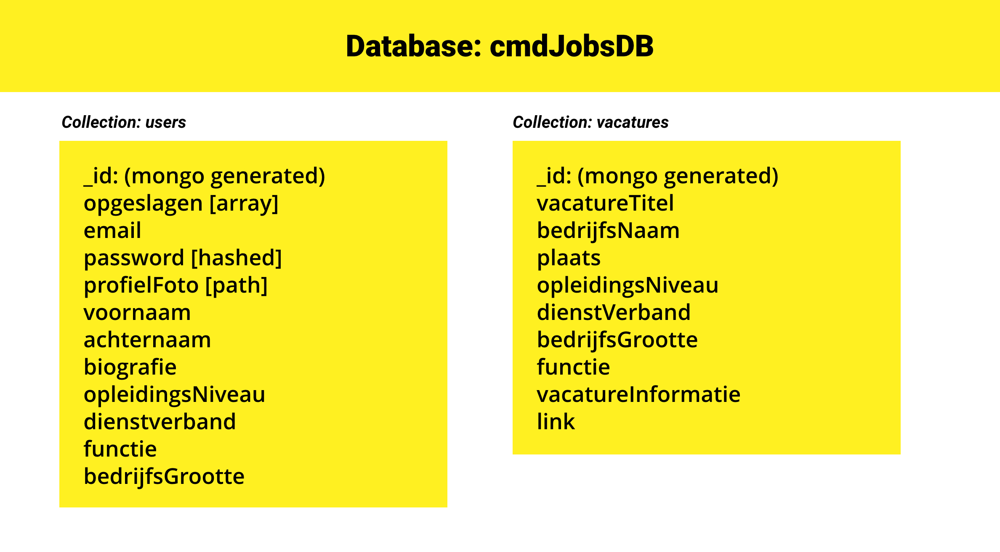

# 

## Inhoudsopgave
  - [Inhoudsopgave](#Inhoudsopgave)
  - [Wat is CMD-JOBS?](#wat-is-cmd-jobs)
  - [Functies](#Functies)
  - [Documentatie](#Documentatie)
  - [Installeren](#Installeren)
  - [Makers](#Makers)
  - [Bijdragen](#Bijdragen)
  - [Licentie](#Licentie)
  - [Bronnen](#Bronnen)

## Wat is CMD-JOBS?
CMD-JOBS is een online vacature-bureau waar we voor jou de perfecte baan vinden! Door te filteren op jouw intresses, zorgen wij ervoor dat je alleen maar vacatures te zien krijgt die bij jou passen!

## Functies
|                                                            |     |
| ---------------------------------------------------------- | --- |
| 🔐⠀Maak een account.                                       | ✔   |
| 🔑 ⠀Login!                                                 | ✔   |
| 🙋‍♀️⠀Maak en bewerk je eigen profiel                       | ✔   |
| 💬 ⠀Bekijk en sla vacatures op die jouw interesseren!⠀     | ✔   |
|                                                            |     |


## Documentatie
De documentatie van deze app is te vinden in de [wiki](https://github.com/CMD-JOBS/CMD-JOBS/wiki) van **CMD-JOBS**.

## Installeren
Clone deze repository naar jouw lokale folder
```git
git clone https://github.com/CMD-JOBS/CMD-JOBS.git
```
<br>

Installeer de bijbehorende packages
```js
npm install
```
<br>

Stel jouw database gegevens in
```js
DB_URI= mongo link
```




<br>

Als je de database hebt ingesteld, start je de server:
```js
npm start
```

### 🚀 (optioneel) open Strapi CMS
Om Strapi te starten moet je de volgende command gebruiken:
```
user@LAPTOP-SRF1LL8U:~/CMD-JOBS$ cd cmdjobs/
user@LAPTOP-SRF1LL8U:~/CMD-JOBS/cmdjobs$ npm run develop
```
Als dit is gelukt kan je in je webbrowser verbinden met de CMS door naar [http://localhost:1337/admin](http://localhost:1337/admin) te gaan.

Hier kan je een account aanmaken als administrator.


## Makers
De makers van **CMD-JOBS** zijn: 
- 🙋🏻‍♀️⠀[*Ashley Keuning*](https://github.com/ashleyKeuning), 
- 🙋🏼‍♂️⠀[*Dylan Troff*](https://github.com/DylanTroff), 
- 🙋🏻‍♂️⠀[*Jorn Veltrop*](https://github.com/jornveltrop), 
- 🙋🏼‍♂️⠀[*Robbin Jansen*](https://github.com/robbinux), 
- 🙋🏻‍♂️⠀[*Yunus Emre Alkan*](https://github.com/YunusEmreCMD)

## Bijdragen
Als je wilt bijdragen aan deze app kun je dat doen door middel van een [Issue](https://github.com/CMD-JOBS/CMD-JOBS/issues).

Zie ook:
* [CONTRIBUTING](https://github.com/CMD-JOBS/CMD-JOBS/blob/main/CONTRIBUTING.md)
* [CODE OF CONDUCT](https://github.com/CMD-JOBS/CMD-JOBS/blob/main/CODE_OF_CONDUCT.md)

## Licentie
Dit project valt onder de MIT [license](https://github.com/CMD-JOBS/CMD-JOBS/blob/main/LICENSE).

## Bronnen
Hier vind u onze [bronnen](https://github.com/CMD-JOBS/CMD-JOBS/wiki/Bronnenlijst).

